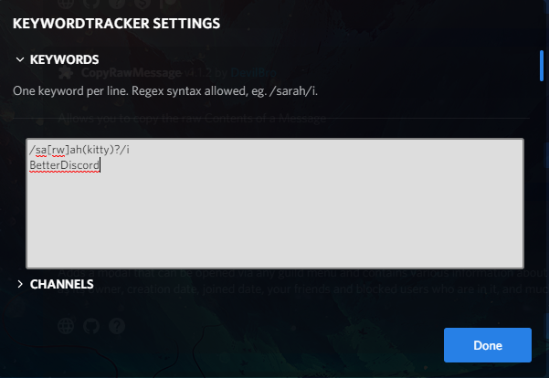
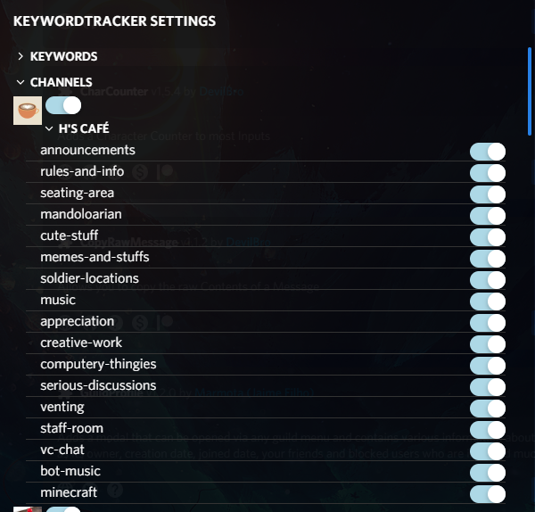
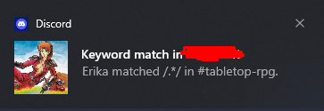
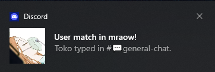
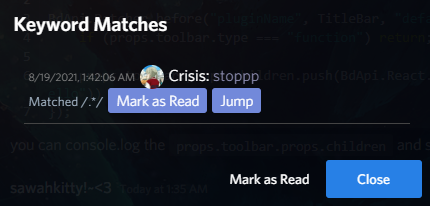

# KeywordTracker

Allows you to set keywords, and servers to watch, so that you get notifications whenever someone says that word :)

Built off [zlib](https://github.com/rauenzi/BDPluginLibrary).

## This is a build artifact

View and edit the source here: https://github.com/sarahkittyy/KeywordTrackerSource

## Screenshots

### Keyword Panel

### Channel Panel

### Notification

#### Text Notification

#### User Notification

### Inbox

